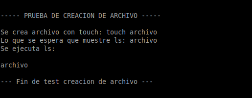
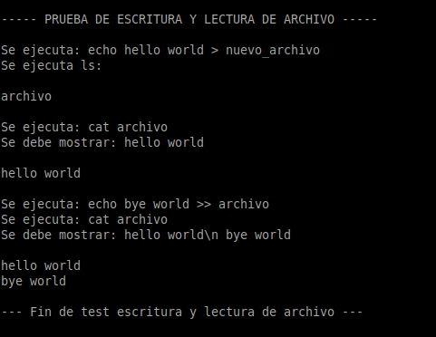
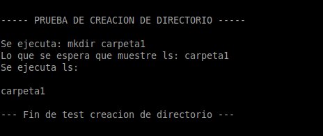
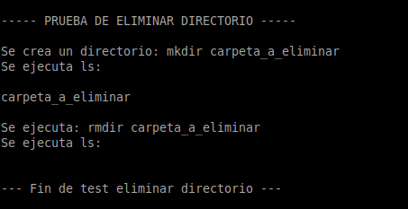
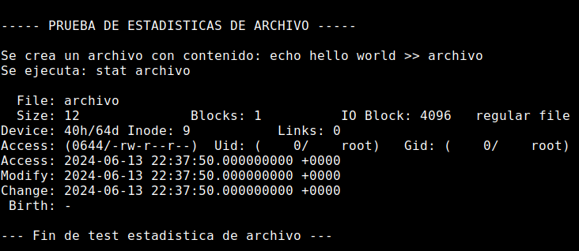

# fisop-fs

## Estructuras

### Estructura del filesystem:

```c
struct filesystem {
	superblock_t superblock;
	inode_t inodos[MAX_INODOS];
	block_t bloques[MAX_INODOS];
	int bitmap_inodos[MAX_INODOS];
	int bitmap_bloques[MAX_BLOQUES];
} typedef filesystem_t;
```

Cuenta con un superbloque que tiene informacion del filesystem como la cantidad de inodos y bloques que tiene.
Tambien cuenta con un vector de inodos, un vector de bloques y con sus respectivos bitmaps que son los que determinaran si el bloque/inodo esta disponible.

Optamos por una estructura donde cada inodo corresponde unicamente a un bloque, es decir que el contenido del inodo va a estar almacenado en un unico bloque.
Por lo tanto, cada inodo conoce la posicion donde se encuentra el bloque donde esta almacenado el contenido.

La cantidad maxima de inodos es 80, debido a que segun el libro **"Operating Systems: Three Easy Pieces"** la cantidad maxima es esa.
Si bien la cantidad maxima de bloques en un Filesystem es de 56 segun el libro **"Operating Systems: Three Easy Pieces"** , como nosotros tenemos una estructura 1 a 1 entre bloques e inodos ambos maximos deben ser iguales y optamos por usar el maximo de inodos.

### Bloque:

```c
struct block {
	char contenido[MAX_CONTENIDO];
} typedef block_t;
```

Esta estructura contiene el contenido correspodiente a cada archivo o directorio.

### Inodo:

```c
struct inode {
	int id;
	int size;
	int type;
	mode_t mode;
	time_t atime;
	time_t mtime;
	char name[MAX_FILENAME];
	int indice_bloque;
} typedef inode_t;
```

La estructura del inodo contiene la metadata de un archivo o directorio. La metadata que contiene el inodo implementado es:

- id: identificador del inodo. En nuestra implementacion decidimos que el id sea igual a su indice. (Contenido por default es cero)
- size: tamaño del inodo. Si no tiene contenido su tamaño es cero. (Contenido por default es cero)
- type: indica si es de tipo archivo o directorio. (Contenido por default es -1)
- mode: permisos del archivo. (Contenido por default es cero)
- atime: el tiempo del ultimo acceso. (Contenido por default es time(NULL))
- mtime: el tiempo de la ultima modificacion. (Contenido por default es time(NULL))
- name: el path del archivo o directorio. (Contenido por default es "")
- indice_bloque: el indice del bloque en el cual esta el contenido del inodo. (Contenido por default es -1)

### Super bloque:

```c
struct superblock {
	int bloques;
	int inodos;
} typedef superblock_t;
```

Esta estructura contiene la cantidad maxima de inodos y bloques que admite el filesystem.

## Cómo el sistema de archivos encuentra un archivo específico dado un path

Sabiendo que no podemos crear dentro de un directorio un archivo o directorio con el mismo nombre, buscamos por nombre de path.
El nombre que contiene el inodo es el nombre del path, es decir que si creamos un directorio llamado hola y dentro del directorio un archivo llamado hola, el inodo del directorio tendra de nombre **/hola** y el del archivo **/hola/hola**

## Persistencia

Implementamos la persistencia de la manera mas secilla que se nos ocurrio, evitando complicaciones.
Simplemente hacemos un **write** del **struct filesystem** y de esta manera la informacion del struct se guarda en un archivo de tipo binario donde la informacion se almacena secuencialmente a como se encuentra estructurado el **struct**, es decir que en nuestro caso se almacenaran primero la informacion del superbloque (inodos y bloques), luego la Metadata del Inodo (que es todo el **struct Inodo**), luego los bloques con sus contenidos y luegos los bitmaps.
Al inicializar se hace un **read** del **struct filesystem** y, como previamente se almaceno en el archivo de manera secuencia, ahora esa informacion es tomada y almacenada nuevamente en el struct de manera secuencial.
El proceso de lectura y escritura en binario garantiza que los datos se mantengan en el mismo formato y orden.

## Salidas de las pruebas implementadas

- Salida de creacion de archivos



- Salida de eliminar un archivo


- Salida de escritura y lectura de un archivo



- Salida de la creacion de un directorio



- Salida de eliminar un directorio



- Salida de las estadisticas de un archivo



## Como ejecutar los test

Para ejecutar los test se deben abrir dos terminales, y seguir los siguientes pasos, iniciando por los comandos de la terminal1:

Terminal1:

- ejecutar: _make docker-run_
- ejecutar: _make mount_

Terminal2:

- ejecutar: _make docker-attach_
- ejecutar: _make test_
