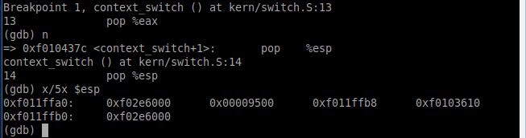
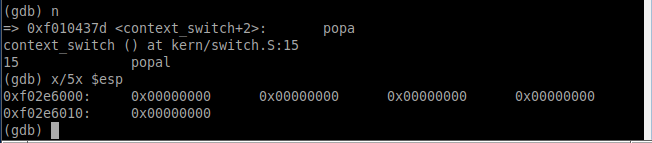
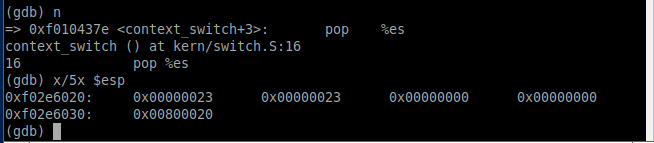
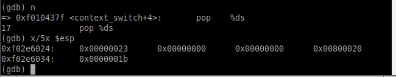

# sched

Lugar para respuestas en prosa, seguimientos con GDB y documentación del TP.

## Parte 1: Cambio de contexto

### De modo kernel a modo usuario

**El estado del stack al inicio de la llamada de context_switch.**

**Cómo cambia el stack instrucción a instrucción**

1. 

2. 

3. 

4. 

5. 

**Cómo se modifican los registros luego de ejecutar iret**

- Antes de ejecutar iret

- Después de ejecutar iret

---

## Parte 3: Scheduler con prioridades

Para esta parte implementamos un sistema de prioridades con tikects de loteria (Proportional Share). Cada proceso tiene una cantidad inicial de tickets (10) esto establece una base equitativa desde el principio y permite un margen para ajustar la prioridad de los procesos durante su ejecución.

En cada ejecución del proceso se le restará un ticket siendo el mínimo de tickets (1) que puede tener un proceso de esta forma se introduce la dinámica en la cual los procesos mas activos (que son seleccionados con mayor frecuencia) verán una disminución en su número de tickets, así se reduce la probabilidad de ser seleccionado en futuras iteraciones. Esto puede ayudar a evitar que un solo proceso acapare el CPU.

Luego al ejecutar se elige un número de ticket ganador aleatorio entre 1 y el total de tickets de todos los procesos que se encuentran en estado RUNNABLE.

Al obtener el ticket ganador, se recorre la lista de procesos sumando los tickets de cada uno hasta que la misma sea mayor al ticket ganador, con esto se asegura que los procesos con más tickets tienen mayor probabilidad de ser seleccionados.
En el caso de que varios procesos tengan la misma cantidad de tickets se ejecutará el primero en cumplir con la condición de ticket ganador.

Cada vez que un proceso llegue a la cantidad mínima (1) de tickets se le reiniciará a la cantidad inicial (10). Se opto por esta alternativa dado que, siguiendo con la premisa de hacerlo de una forma sensilla, nos parecio algo intuitivo y como es un scheduler de prioridad por LOTERIA tener prioridad 10 o 1 no indica que el 10 se ejecutara primero que el uno ni lo contrario.

### Syscalls implementadas

sys_get_tickets: Se la utiliza para obtener la cantidad de tickets que tiene el proceso recibido por parámetro.

sys_set_tickets: Recibe el proceso por parámetro, reduce la cantidad de tickets del mismo mientras no sea igual a la cantidad mínima de tickets,
en caso de serlo se le asigna el máximo de tickets y suma en uno la cantidad de reseteos.
